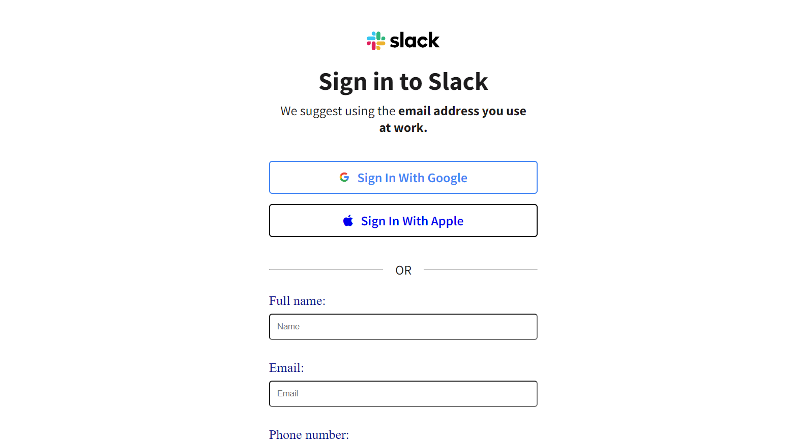

# Side Hustle - Login page component solution

This is a solution to the [Login page component challenge on Side Hustle](https://lms.terrahq.co/). Side Hustle challenges help you improve your coding skills by building realistic projects. 

## Table of contents

- [Overview](#overview)
  - [The challenge](#the-challenge)
  - [Screenshot](#screenshot)
  - [Links](#links)
  - [My process](#my-process)
  - [Built with](#built-with)
  - [What I learned](#what-i-learned)
  - [Continued development](#continued-development)
  - [Useful resources](#useful-resources)
- [Author](#author)
- [Acknowledgments](#acknowledgments)

## Overview

### The challenge

Users should be able to:

- View the optimal layout depending on their device's screen size
- See hover and focus states for interactive elements

### Screenshot

### Links

- Solution URL: [That is the link to my github repo](https://github.com/lawal-sherif-itunu/slack)
- Live Site URL: [That is the live site URL](https://lawal-sherif-itunu.github.io/slack/)

## My process

### Built with

- Semantic HTML5 markup
- CSS custom properties
- CSS Grid
- Mobile-first workflow

### What I learned

I learnt and revised how to grid and flex. 

### Continued development

CSS for now

### Useful resources

- [Kevin grid tutorial](https://www.youtube.com/watch?v=rg7Fvvl3taU) - This helped me for learning grid.

## Author

- Website - [Lawal Sherif](https://github.com/lawal-sherif-itunu)
- Frontend Mentor - [@lawal2000e](https://www.frontendmentor.io/profile/lawal2000)
- Twitter - [@SherifLawal12](https://twitter.com/SherifLawal12)

## Acknowledgments

Big thanks to my frontend team for always checking up on me that I am consistent. Also big thanks to Nonse from Web2/Web3 Dev with OAU.